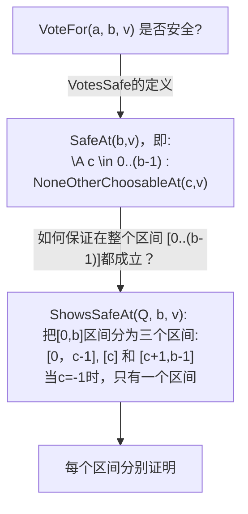
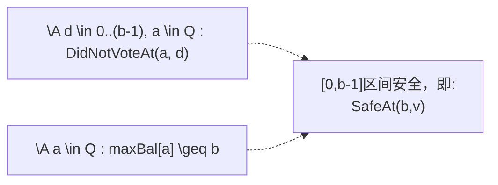
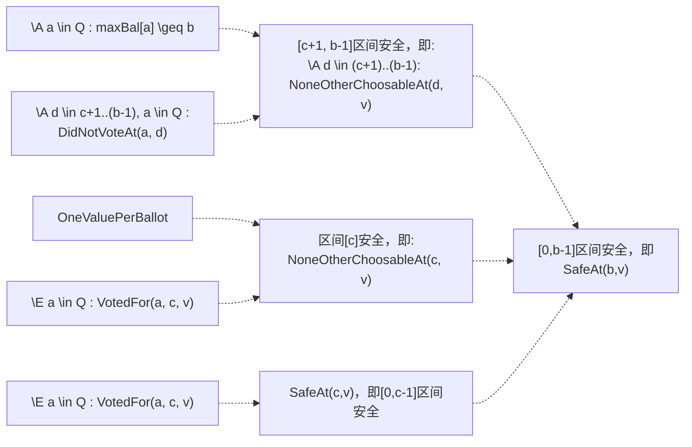

#                                                            Paxos难以理解？了解下其归纳法推理吧

---

[TOC]

# 1. 简介

关于Paxos和CAP这些理论已经有很多介绍，本文的重点不是Paxos协议本身。而是是顺着Lamport的思路，即如何用形式化的方法，把Consensus => Voting => Paxos这三部曲给理清楚，这三个步分别对应概念(目标)、归纳法推理和协议实现。在这个过程中我们也顺便学习下Lamport是如何逐层抽象和思考的。

本文假设读者已有Paxos相关基础，知道它解决什么问题，解决的难点在哪(知道Split Brain、Network Partition等问题)。如果读者完全没有相关背景，请自行在网上找相关资料阅读。

本文档的内容主要有以下两个来源，再加一些个人见解。

1) Lamport 2019年在俄罗斯 [讲解Paoxs TLA+的视频](http://lamport.azurewebsites.net/tla/paxos-algorithm.html?back-link=more-stuff.html#paxos?unhideBut@EQhide-paxos@AMPunhideDiv@EQpaxos)。Lamport在其中提到了他当年就是沿着这个思路来思考的并逐步演变出Paxos的，虽然当时没有TLA+。

2）Paxos的TLA+ Spec，来自[github地址](https://github.com/tlaplus/Examples/tree/master/specifications/Paxos)。Paxos的Spec实际上包含了三个Spec文件：Consensus.tla、Voting.tla 和Paxos.tla。

下面分别介绍着三个文件。

# 2. "Consensus" 的形式化定义

## 2.1 简介

**Consensus**这个词，经常被翻译为“一致”，我认为“一致”这个词，含义太多了。而“共识”这个词更为贴切，后续都会用这个词。

什么是共识？怎么用数学去形式化地描述共识？Consensus.tla 就是对Consensus这个概念的形式化描述，它实际上就是在描述概念本身。没有描述任何实现。

简单来说：==达成共识，就是选定了一个值(A value is chosen)，一旦选定就不可更改==。

考察Consensus.tla，我们会发现：

- 它描述的状态机一共只有初始状态和选定两个状态，无其他状态； 
- 没有体现参与者、Quorum、Proposal、Vote这些过程，只描述了Choose这一个动作；
- 共识自身的含义是通过 Safety 属性来定义的。

## 2.2 Consensu.tla 解析

==如果下面的Spec内容没有高亮显示，请用浏览器打开==

下面把 Consensus.tla 分段解析。我们跳过了spec中的部分定理(THEOREM)部分。

### 2.2.1 模块和常量定义部分

- MODULE名字，必须跟文件名相同
- EXTENDS 类似于代码中的 Import/Include
- CONSTANT Value，常量Value是个候选值集合，在运行Model Checker前，先填写集合元素。
- chosen也是一个集合，它是个变量，在Model Check过程中可以被修改

```
----------------------------- MODULE Consensus ------------------------------ 
EXTENDS Naturals, FiniteSets
CONSTANT Value 
VARIABLE chosen
```

### 2.2.2  类型约束、状态变更

- TypeOK: 类型检查，chosen必须是Value的子集,并且是有限集
- Init: 初始状态，需要满足条件：chosen = {}
- Next包含两部分：使能条件和状态变更。使能条件是chosen = {}；状态变更动作：从集合Value中找一个值v，构造单元素集合[v}，使得下一个状态满足chosen = [v}。注意，只有使能条件成立时，才会执行状态变更。
- Spec: 这个是标准形式，允许Stuttering step，即所有变量都不变化。

```
TypeOK == /\ chosen \subseteq Value
          /\ IsFiniteSet(chosen) 
Init == chosen = {}

Next == /\ chosen = {}
        /\ \E v \in Value : chosen' = {v}

Spec == Init /\ [][Next]_chosen 
```

### 2.2.2  Safety 和 Liveness

- Inv: Safety约束，**也是Consensus的核心**：chosen为空，或者只有一个值。Cardinality是集合的度，即元素个数。
- LiveSpec: WF是Weak Fairnress，即如果Next的使能条件一直成立，那么Next的状态变更动作，最终一定会执行。

```tla+
Inv == /\ TypeOK
       /\ Cardinality(chosen) \leq 1
LiveSpec == Spec /\ WF_chosen(Next)  
```


## 2.3 对 Consensu.tla 执行 Model Check


## 2.4 思考

- Safety的定义是准确的么？是否还有满足Safety，但是却违背了共识的含义的场景？
- 试着改变下Next，用其他方式修改chosen，但是却能保持 Cardinality(chosen) = 1?

# 3. Paxos的归纳法推理：Voting.tla

Voting.tla，比Consensus.tla要复杂，有不少理论，但是一旦理解这个抽象和推理，再去理解paxos就不会觉得晦涩了。因此需要抓住主线：理解如何用归纳法得出Vote时需要满足的Safe条件 ，尤其是理解**NoneOtherChoosableAt 和 ShowsSafeAt**以及相关定理。

Voting.tla里面没有涉及Paxos的Phase1和Phase2，但是它里面的**归纳法推理才是Paxos算法正确性的核心**。理解这个推理，再去理解Paxos就非常自然了。

> Allow an acceptor to vote for value  $v$ in ballot $b$ only if no value other than $v$ has been or **ever will be chosen** in any ballot numbered less than $b$.

## 3.1 常量和变量定义部分

- 常量 Value、Acceptor、 Quorum和Ballot都需要在执行TLC Model Checker时预先定义。Quorum是多个合法的Quorum的集合。Ballot是允许出现的Ballot Number，为了防止状态无限多，实际运行时需要限制 Ballot集合里面的元素个数。

- QuorumAssumption类似于程序里面的assert，即认为任意两个quorum Q1, Q2都是相交的(至少有一个共同元素)，检查Quorum常量值的合法性。

- 定理 QuorumNonEmpty 可以理解为理论性注释，即任意quorum Q都不为空。

- votes 和 maxBal 都是 function，两个 function 的 domain 都是 Acceptor。用于记录每个Acceptor的投票记录以及收到的最大Ballot。参见 TypeOK 的定义。

```
------------------------------- MODULE Voting ------------------------------- 
EXTENDS Integers 
-----------------------------------------------------------------------------
CONSTANT Value,     \* The set of choosable values.
         Acceptor,  \* A set of processes that will choose a value.
         Quorum     \* The set of "quorums", where a quorum" is a 
                    \*   "large enough" set of acceptors
CONSTANT Ballot

ASSUME QuorumAssumption == /\ \A Q \in Quorum : Q \subseteq Acceptor
                           /\ \A Q1, Q2 \in Quorum : Q1 \cap Q2 # {}  

THEOREM QuorumNonEmpty == \A Q \in Quorum : Q # {}
-----------------------------------------------------------------------------
VARIABLE votes,   \* votes[a] is the set of votes cast by acceptor a
         maxBal   \* maxBal[a] is a ballot number.  Acceptor a will cast
                  \*   further votes only in ballots numbered \geq maxBal[a]
                  
TypeOK == /\ votes \in [Acceptor -> SUBSET (Ballot \X Value)]
          /\ maxBal \in [Acceptor -> Ballot \cup {-1}]
```


## 3.2 基本操作定义

- VotedFor(a, b, v):  Acceptor a曾经投票给选票($b$, $v$)
- ChosenAt(b, v): 存在一个Quorum Q，Q 里面每个成员都曾经投票给($b$, $v$)。我们常说的形成决议/形成多数派/选定一个值，都是这个含义。
- chosen，注意这个与Consensu.tla里面的定义不同，它是动态构建的，类似于数据库里的 View的概念，是选定的值的集合。
- DidNotVoteAt(a, b):  Acceptor a从未给任何 BN = b 的选票投票
- CannotVoteAt(a, b)： Acceptor a不能再给任何 BN = b的选举投票，因为maxBal[a] >b并且DidNotVoteAt(a, b)。 为什么需要 DidNotVoteAt? 因为 chosen 是计算已有投票获得的，如果以前投过，就已经计算上了。

```tla
VotedFor(a, b, v) == <<b, v>> \in votes[a]
  
ChosenAt(b, v) == \E Q \in Quorum : 
                     \A a \in Q : VotedFor(a, b, v)

chosen == {v \in Value : \E b \in Ballot : ChosenAt(b, v)}
  
DidNotVoteAt(a, b) == \A v \in Value : ~ VotedFor(a, b, v) 

CannotVoteAt(a, b) == /\ maxBal[a] > b
                      /\ DidNotVoteAt(a, b)
```


### NoneOtherChoosableAt(b, v)

- 定义: 存在一个Quorum Q，其中任意一个Acceptor a，要么已经投票 (b,v)，要么没有为Ballot b投票，且永远不会为b投票。
- 意义: 除了 v以外，不可能有任何其他value，可以用Ballot  b被选定
- 反证：假设不成立，即存在某个Value $w$, $w\ne v$, 并且有ChosenAt(b, w)。则必须有某个 Quorum R，R内所有Acceptor都需要给(b, w)投票，根据Quorum的含义，R必然与 Q有交集，这与前提矛盾。

### SafeAt(b, v)

- 定义： 任意Ballot $c$: $c < b$，NoneOtherChoosableAt(c, v)都成立。即：不可能用小于b的Ballot Number，选定v以外的任何值。

  


### ShowsSafeAt(Q, b, v)

```
ShowsSafeAt(Q, b, v) == 
  /\ \A a \in Q : maxBal[a] \geq b
  /\ \E c \in -1..(b-1) : 
      /\ (c # -1) => \E a \in Q : VotedFor(a, c, v)
      /\ \A d \in (c+1)..(b-1), a \in Q : DidNotVoteAt(a, d)
```

### 

注意这个是每个Acceptor在投票前实际需要检查的条件，而不是推理，解释如下：

- 存在一个Quorum Q，同时满足下面的Cond 1和Cond2：
- **Cond 1:** Q内任意一个Acceptor a，满足$maxBal[a] >= b$
- **Cond2:** 存在一个小于b的Ballot c，同时满足下面两个条件：
  - **Cond 2.1:** 如果 $c \ne -1$，则满足：Q中至少有一个Acceptor a, a给(b, v)投过票。注意，如果 $c == -1$，则没有限制，这是一个特殊场景，即所有Acceptor都没有投过票。
  - **Cond 2.2:** Q中没有任何Acceptor a，给[c+1, b-1]之间的任何Ballot Number投过票。即Q里面的所有 Acceptor在[c+1, b-1]这个区间，都完全没有投票，只增加了maxBal。

其中：

- Cond 1和Cond 2.2 保证了[c+1, b-1]这个区间不可能选定任何值。
- Cond 2.1的定义，如果c不等于-1，则有VotedFor(a,c,v)，那么这个Vote发生时已经保证了SafeAt(c,v)；
  VotedFor(a,c,v)和OneValuePerBallot，保证了如果Ballot c选定了某个值，那么这个值只能是v，也就是NoneOtherChoosableAt(c, v)；
- ShowsSafeAt(Q, b, v) 与 SafeAt(b, v)的最大不同点：前者只需要收集Quorum的response，而不需要全部，是个可行的Enabling Condition。


### OneValuePerBallot

- 任意2个不同Acceptor，如果给同一Ballot的选票投票，那么Value必须相同
- 在Voting.tla里面，没提如何实现OneValuePerBallot ( Paxos才描述具体如何做到 )；
- 与OneVote的区别是：OneValuePerBallot讨论的是不同的Acceptor

```
VotesSafe == \A a \in Acceptor, b \in Ballot, v \in Value :
                 VotedFor(a, b, v) => SafeAt(b, v)

OneVote == \A a \in Acceptor, b \in Ballot, v, w \in Value : 
              VotedFor(a, b, v) /\ VotedFor(a, b, w) => (v = w)
OneValuePerBallot ==  
    \A a1, a2 \in Acceptor, b \in Ballot, v1, v2 \in Value : 
       VotedFor(a1, b, v1) /\ VotedFor(a2, b, v2) => (v1 = v2)
```

### 

## 3.3 归纳推理核心部分

==Voting.tla 里面的部分才是Paxos的核心。Paxos.tla 更多是这个理论的具体实现。==

在前述部分的基础上，我们可以描述Voting模块部分的推理过程。假设OneValuePerBallot可以保证(先不管如何做到的)，且每个Voter的每次投票，都需要保证安全是否可以做到呢？

我们首先得知道投票安全的含义是什么，然后说怎么保证。下面是个简单的过程描述。




下面是最核心部分，我们先用图说明如何从ShowSafeAt(Q, b, v)推理出SafeAt(b,v)，这个推理成立，即可保证VotesSafe。

### 3.3.1 $ c = -1$ 的场景

如果ShowSafeAt(Q,b,v)里面的c是-1，那么推理非常简单：Q内所有成员，在$[0, b-1]$区间都没有Vote过, 且不能再vote（$maxBal[a]>b$)，那么在[0, b-1]区间，不可能选定任何值。



由于markdown绘图手段有限，我们用带箭头的虚线，表示一个或者多个前提条件都成立时，蕴含了箭头指向的断言。例如，上图中，左侧两个条件在一起，蕴含了右边的式子。

### 3.3.2  $c \ne -1$的场景

Q内成员，有至少一个成员Vote过，其所有成员Vote过的最大Ballot Number是c。即Q内所有成员，在[c+1, b-1]区间都没有Vote过。在这种情况下，[0,c-1]区间的安全性，分为三个区间来分别推理。详见下面的图。




## 3.2 其他部分解析

### 定理 AllSafeAtZero

- 这个理论之所以成立，是因为不可能有$<0$ 的Ballot形成决议，因为$<0$的选举，不会被 Accept.

### 定理 ChoosableThm

- 这个是对"选定"的一个断言：只要 ChosenAt(b, v)成立，NoneOtherChoosableAt(b, v)一定成立。

```
NoneOtherChoosableAt(b, v) == 
   \E Q \in Quorum :
     \A a \in Q : VotedFor(a, b, v) \/ CannotVoteAt(a, b)

SafeAt(b, v) == \A c \in 0..(b-1) : NoneOtherChoosableAt(c, v)

-----------------------------------------------------------------------------
THEOREM AllSafeAtZero == \A v \in Value : SafeAt(0, v)
-----------------------------------------------------------------------------
THEOREM ChoosableThm ==
          \A b \in Ballot, v \in Value : 
             ChosenAt(b, v) => NoneOtherChoosableAt(b, v)
-----------------------------------------------------------------------------
```

### OneVote

- 如果某个Acceptor先后给(b, v) 和 (b, w)投票，那么v一定跟w相等
- 这个实际上隐含了: 一个 Acceptor给同一Ballot投票多次是允许的，只要Value不变

### 定理 VotesSafeImpliesConsistency

- 如果能满足TypeOK, VotesSafe和OneVote都成立，那么chosen最多只有一个值，不会选定多个。其中:
  - VotesSafe: 保证更小的**Ballot不会形成其他Value的决议**
  - OneVote: **同一Ballot**，不会有多个Value被投票，所以不会选定多个值


### 定理 ShowsSafety

- 定理的含义:  如果TypeOK /\ VotesSafe /\ OneValuePerBallot成立，那么ShowsSafeAt(Q, b, v) => SafeAt(b, v)

```
-----------------------------------------------------------------------------
THEOREM OneValuePerBallot => OneVote
-----------------------------------------------------------------------------
THEOREM VotesSafeImpliesConsistency ==
          /\ TypeOK 
          /\ VotesSafe
          /\ OneVote
          => \/ chosen = {}
             \/ \E v \in Value : chosen = {v}
-----------------------------------------------------------------------------
ShowsSafeAt(Q, b, v) == 
  /\ \A a \in Q : maxBal[a] \geq b
  /\ \E c \in -1..(b-1) : 
      /\ (c # -1) => \E a \in Q : VotedFor(a, c, v)
      /\ \A d \in (c+1)..(b-1), a \in Q : DidNotVoteAt(a, d)
-----------------------------------------------------------------------------
THEOREM ShowsSafety == 
          TypeOK /\ VotesSafe /\ OneValuePerBallot =>
             \A Q \in Quorum, b \in Ballot, v \in Value :
               ShowsSafeAt(Q, b, v) => SafeAt(b, v)
```


### ## 3.5 Voting的一些FAQ

### 如何用归纳法证明 ShowsSafety?

- 根据ShowSafeAt(Q, b, v)的定义，我们将Ballot分为3个区间，[-1, c-1]、c和[c+1, b-1]。

- 如果 $c == -1$，，则Q内Acceptor都没有投过， SafeAt(b, v)成立。

- 如果$c \ne -1$，分别考察三个区间，证明这三个区间都不可能选定v 以外的值。

  ```
  ShowsSafeAt(Q, b, v) /\ C # -1 
     => \E a \in Q: VotedFor(a, c, v) 
         => SafeAt(c, v)；
    (* SafeAt(c, v)本身就意味着[-1, c-1]这段没问题                     *)
  
  OneValuePerBallot /\ VotedFor(a, c, v) 
      =>  ~ \E w \in Value, a \in Q :
                           /\ w # v 
                           /\  VotedFor(a, c, w)
      => NoneOtherChoosableAt(c, v)
    (* OneValuePerBallot保证不会有其他的value w，出现VotedFor(a, b, w)，*)
    (* 因此w更不可能被选中                                                *)
  
  ShowsSafeAt(Q, b, v) /\ c # -1
  =>   /\ \A a \in Q : maxBal[a] \geq b
       /\ \A d \in (c+1)..(b-1), a \in Q : DidNotVoteAt(a, d)
  =>  \A a \in Q, d \in (c+1)..(b-1): CannotVoteAt(a, d)
  
  \A a \in Q, d \in (c+1)..(b-1): CannotVoteAt(a, d) /\ QuorumAssumption
  =>  \A d \in (c+1)..(b-1), v \in Value: ~ChosenAt(d, w) 
     
    (* 由于Quorum个Acceptor在[c+1, b-1]没有投票，且maxBal都大于等于b，    *)
    (*   因此不可能用这个区间的Ballot Number形成决议                      *)
  ```

  

  

### ShowSafeAt，并没有要求maxBal[a]<=b，而是>=b，那么怎么阻止小的Ballot去形成决议呢？

```
ShowsSafeAt(Q, b, v) == 
  /\ \A a \in Q : maxBal[a] >= b
```

- 虽然要求Quorum的 maxBal[a] >= b，但是VoteFor时，必须有maxBal[a] <= b。这样就只可能为b形成决议，而 < b的x，VoteFor 不会被执行。

```
VoteFor(a, b, v) ==
    /\ maxBal[a] <= b
    /\ ...
```


###  Voting.tla 里面 OneValuePerBallot 是怎么保证的？

- 参见VoteFor的条件，实际上是检查了所有acceptor的vote，对于数学抽象可以这么写。但是实际上系统中很难原子地检查所有Acceptor的vote。

```
VoteFor(a, b, v) ==
 ...
    /\ \A c \in Acceptor \ {a} : 
         \A vt \in votes[c] : (vt[1] = b) => (vt[2] = v)
```

- 对于Paxos，实际上从两方面保证：不同的Proposer可用的Ballot Number集合是不同的。同一Proposer，在使用Ballot Number时，不会修改Value。

### 有了Voting.tla，为什么还需要Paxos?

- 因为它用上帝视角在做vote。例如，VoteFor里面的判断所有Acceptor状态、投票都认为是原子操作。但是实际不可能让别的Acceptor停下来，等待自己干完活。

- Paox把所有的操作看成了异步的，各个节点间解耦，只需要根据消息通信来运行。

  

### Voting.tla 有没有类似于Phase1的操作？

-  IncreaseMaxBal比较接近。但是非常简要，纯数学抽象表示，没有描述消息过程。

- 如果没有这个步骤，那么就没法取得进展了。因为 ShowsSafeAt就需要各个Acceptor的 maxBal[a]>=b，就是隐含执行了phase1a。

### 

## 4. Paxos.tla 解析

### Voting TLA里面的rules
[视频](https://youtu.be/8-Bc5Lqgx_c?t=2069)

- Don't allow  different acceptors to vote for diffrent values in the same ballot
=> 如何做到OneValuePerBallot？ Each ballot has a unique leader process(具体leader是谁不重要)
- Allow an acceptor to vote for value v in ballot b only if v is safe at b

每个ballot的phase2a message，只会发送一次，所以同一个ballot，不可能有两个value。
```
(* The first conjunct of Phase2a(b, v) asserts that at most one phase 2a   *)
(* message is ever sent for ballot b.  Since an acceptor will vote for a   *)
(* value in ballot b only when it receives the appropriate phase 2a        *)
(* message, the phase 2a message sent by this action this ensures that     *)
(* these two enabling conjuncts of VoteFor(a,b,v) will be true forever:    *)
```
=>
下面这个检查，在数学上是可以保证一个ballot的phase2a不会发送两次。但是工程上如何实现呢？
```
  /\ ~ \E m \in msgs : m.type = "2a" /\ m.bal = b
```


### 关于msgs 
- 虽然msgs看起来是个保留所有消息的集合，但是这是数学表示。工程师们懂得如何避免保存所有的msg。


> 其Inv，保证的主要是1a, 1b, 2a, 2b各个消息的基本特性。而不是从全局角度考虑。

### Paxos 如何保证VoteFor需要满足的条件？
- VoteFor的后条件2-4，都满足了？
```
(* In the Phase2a(b, v) action, the ballot b leader sends a type "2a"      *)
(* message asking the acceptors to vote for v in ballot number b.  The     *)
(* enabling conditions of the action--its first two conjuncts--ensure that *)
(* three of the four enabling conditions of action VoteFor(a, b, v) in     *)
(* module Voting will be true when acceptor a receives that message.       *)
(* Those three enabling conditions are the second through fourth conjuncts *)
(* of that action.                                                         *)
```
### 有leader的Paxos/Raft，如何做到 OneValuePerBallot?
- Ballot实际上对应了Term
- 利用Quorum的特性，每次当选后，必然对应了不同的term
- 只有在未Commit的窗口的哪些，需要重新走Phase 1，窗口之后的，直接走Phase 2即可，因为没有走过Phase 1，再执行一遍，肯定得到返回值都是空值。


### 为何phase1b和phase2b都要设置maxBal[a]?
=> 因为answer phase1b的acceptor，不一定是accept 2b的。两个Quorum可以不同。
Lamport的[回答也如此](https://youtu.be/8-Bc5Lqgx_c?t=4175)

- [x] TLA toolbox实际运行，是不是会出现僵局？ 怎么让状态变得有限？
- 实际运行时，配置的Ballot有限(MCPaxos里面)，到时候自然结束了
  
### 如何Implement Voting?
[视频这一段开始](https://youtu.be/8-Bc5Lqgx_c?t=4384)
在paxos里面，定义Votes 为对应的 phase 2b Message
# Lamport视频的一些摘要

## 为什么需要形式化？

- 在写代码之前，应该从数学的角度，知道自己要做什么。
- 用数学去表示，是最准确的

## 关于Falut Model

- Don't think about what may go wrong
- Think what **must** go right
- 我的理解：以消息为例不用考虑收不到，考虑收到了消息会怎么样。

# 思考

- 如何避免串行化？ 怎么把多个操作，合并为一个paxos消息？
- 这个对于分布式系统(raft也是)，非常有帮助。

- 

## msgs这种set，而不是挨个发送，挨个处理，有什么好处？
-  我觉得健壮性更强：因为消息接收者不一定按照发送顺序去处理，而是任何可以看到的消息。后发送的可能先被处理，先发送的可能没被处理。

# 尝试做点改动

## 那些需要持久化？

### 随机的消息丢失，maxBal等不丢失

丢失的不是最新的，而是随机的

### maxBal, maxVBal随机丢失

### maxBal, maxVBal等不一致

如果持久化了maxBal等，那么msg还需要持久化么？

