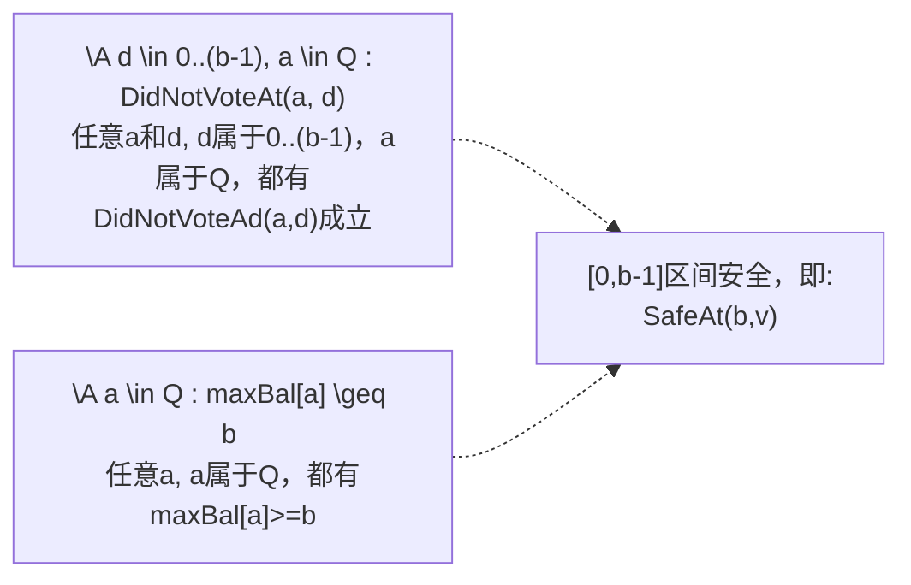
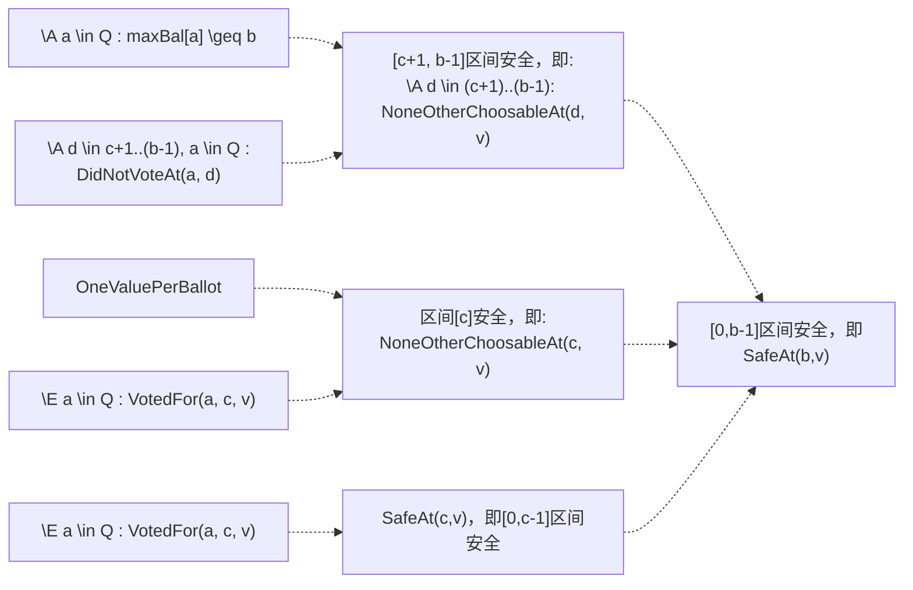

#  共识系列之原理推理

---

Voting.tla，比Consensus.tla要复杂，有不少理论，但是一旦理解这个抽象和推理，再去理解paxos就不会觉得晦涩了。因此需要抓住主线：理解如何用归纳法得出Vote时需要满足的Safe条件 ，尤其是理解**NoneOtherChoosableAt 和 ShowsSafeAt**以及相关定理。

Voting.tla里面没有涉及Paxos的Phase1和Phase2，但是它里面的**归纳法推理才是Paxos算法正确性的核心**。理解这个推理，再去理解Paxos就非常自然了。

> Allow an acceptor to vote for value  $v$ in ballot $b$ only if no value other than $v$ has been or **ever will be chosen** in any ballot numbered less than $b$.

## 3.1 常量和变量定义部分

- 常量 Value、Acceptor、 Quorum和Ballot都需要在执行TLC Model Checker时预先定义。Quorum是多个合法的Quorum的集合。Ballot是允许出现的Ballot Number，为了防止状态无限多，实际运行时需要限制 Ballot集合里面的元素个数。

- QuorumAssumption类似于程序里面的assert，即认为任意两个quorum Q1, Q2都是相交的(至少有一个共同元素)，检查Quorum常量值的合法性。

- 定理 QuorumNonEmpty 可以理解为理论性注释，即任意quorum Q都不为空。

- votes 和 maxBal 都是 function，两个 function 的 domain 都是 Acceptor。用于记录每个Acceptor的投票记录以及收到的最大Ballot。参见 TypeOK 的定义。

```tla
------------------------------- MODULE Voting ------------------------------- 
EXTENDS Integers 
-----------------------------------------------------------------------------
CONSTANT Value,     \* The set of choosable values.
         Acceptor,  \* A set of processes that will choose a value.
         Quorum     \* The set of "quorums", where a quorum" is a 
                    \*   "large enough" set of acceptors
CONSTANT Ballot

ASSUME QuorumAssumption == /\ \A Q \in Quorum : Q \subseteq Acceptor
                           /\ \A Q1, Q2 \in Quorum : Q1 \cap Q2 # {}  

THEOREM QuorumNonEmpty == \A Q \in Quorum : Q # {}
-----------------------------------------------------------------------------
VARIABLE votes,   \* votes[a] is the set of votes cast by acceptor a
         maxBal   \* maxBal[a] is a ballot number.  Acceptor a will cast
                  \*   further votes only in ballots numbered \geq maxBal[a]
                  
TypeOK == /\ votes \in [Acceptor -> SUBSET (Ballot \X Value)]
          /\ maxBal \in [Acceptor -> Ballot \cup {-1}]
```


## 3.2 基本操作定义

- VotedFor(a, b, v):  Acceptor a曾经投票给选票($b$, $v$)
- ChosenAt(b, v): 存在一个Quorum Q，Q 里面每个成员都曾经投票给($b$, $v$)。我们常说的形成决议/形成多数派/选定一个值，都是这个含义。
- chosen，注意这个与Consensu.tla里面的定义不同，它是动态构建的，类似于数据库里的 View的概念，是选定的值的集合。
- DidNotVoteAt(a, b):  Acceptor a从未给任何 BN = b 的选票投票
- CannotVoteAt(a, b)： Acceptor a不能再给任何 BN = b的选举投票，因为maxBal[a] >b并且DidNotVoteAt(a, b)。 为什么需要 DidNotVoteAt? 因为 chosen 是计算已有投票获得的，如果以前投过，就已经计算上了。

```tla
VotedFor(a, b, v) == <<b, v>> \in votes[a]
  
ChosenAt(b, v) == \E Q \in Quorum : 
                     \A a \in Q : VotedFor(a, b, v)

chosen == {v \in Value : \E b \in Ballot : ChosenAt(b, v)}
  
DidNotVoteAt(a, b) == \A v \in Value : ~ VotedFor(a, b, v) 

CannotVoteAt(a, b) == /\ maxBal[a] > b
                      /\ DidNotVoteAt(a, b)
```


### 3.2.1 NoneOtherChoosableAt(b, v)

- 定义: 存在一个Quorum Q，其中任意一个Acceptor a，要么已经投票 (b,v)，要么没有为Ballot b投票，且永远不会为b投票。
- 意义: 除了 v以外，不可能有任何其他value，可以用Ballot  b被选定
- 反证：假设不成立，即存在某个Value $w$, $w\ne v$, 并且有ChosenAt(b, w)。则必须有某个 Quorum R，R内所有Acceptor都需要给(b, w)投票，根据Quorum的含义，R必然与 Q有交集，这与前提矛盾。

### 3.2.2 SafeAt(b, v)

- 定义： 任意Ballot $c$: $c < b$，NoneOtherChoosableAt(c, v)都成立。即：不可能用小于b的Ballot Number，选定v以外的任何值。

  

### 3.2.3 ShowsSafeAt(Q, b, v)

```tla
ShowsSafeAt(Q, b, v) == 
  /\ \A a \in Q : maxBal[a] \geq b
  /\ \E c \in -1..(b-1) : 
      /\ (c # -1) => \E a \in Q : VotedFor(a, c, v)
      /\ \A d \in (c+1)..(b-1), a \in Q : DidNotVoteAt(a, d)
```

注意这个是每个Acceptor在投票前实际需要检查的条件，而不是推理，解释如下：

- 存在一个Quorum Q，同时满足下面的Cond 1和Cond2：
- **Cond 1:** Q内任意一个Acceptor a，满足$maxBal[a] >= b$
- **Cond2:** 存在一个小于b的Ballot c，同时满足下面两个条件：
  - **Cond 2.1:** 如果 $c \ne -1$，则满足：Q中至少有一个Acceptor a, a给(b, v)投过票。注意，如果 $c == -1$，则没有限制，这是一个特殊场景，即所有Acceptor都没有投过票。
  - **Cond 2.2:** Q中没有任何Acceptor a，给[c+1, b-1]之间的任何Ballot Number投过票。即Q里面的所有 Acceptor在[c+1, b-1]这个区间，都完全没有投票，只增加了maxBal。

其中：

- Cond 1和Cond 2.2 保证了[c+1, b-1]这个区间不可能选定任何值。
- Cond 2.1的定义，如果c不等于-1，则有VotedFor(a,c,v)，那么这个Vote发生时已经保证了SafeAt(c,v)；
  VotedFor(a,c,v)和OneValuePerBallot，保证了如果Ballot c选定了某个值，那么这个值只能是v，也就是NoneOtherChoosableAt(c, v)；
- ShowsSafeAt(Q, b, v) 与 SafeAt(b, v)的最大不同点：前者只需要收集Quorum的response，而不需要全部，是个可行的Enabling Condition。

### 3.2.4 OneValuePerBallot

- 任意2个不同Acceptor，如果给同一Ballot的选票投票，那么Value必须相同
- 在Voting.tla里面，没提如何实现OneValuePerBallot ( Paxos才描述具体如何做到 )；
- 与OneVote的区别是：OneValuePerBallot讨论的是不同的Acceptor

```tla
VotesSafe == \A a \in Acceptor, b \in Ballot, v \in Value :
                 VotedFor(a, b, v) => SafeAt(b, v)

OneVote == \A a \in Acceptor, b \in Ballot, v, w \in Value : 
              VotedFor(a, b, v) /\ VotedFor(a, b, w) => (v = w)
OneValuePerBallot ==  
    \A a1, a2 \in Acceptor, b \in Ballot, v1, v2 \in Value : 
       VotedFor(a1, b, v1) /\ VotedFor(a2, b, v2) => (v1 = v2)
```

### 

## 3.3 归纳推理核心部分

==Voting.tla 里面的部分才是Paxos的核心。Paxos.tla 更多是这个理论的具体实现。==

在前述部分的基础上，我们可以描述Voting模块部分的推理过程。假设OneValuePerBallot可以保证(先不管如何做到的)，且每个Voter的每次投票，都需要保证安全是否可以做到呢？

我们首先得知道投票安全的含义是什么，然后说怎么保证。下面是个简单的过程描述。


下面是最核心部分，我们先用图说明如何从ShowSafeAt(Q, b, v)推理出SafeAt(b,v)，这个推理成立，即可保证VotesSafe。

### 3.3.1 $ c = -1$ 的场景

如果ShowSafeAt(Q,b,v)里面的c是-1，那么推理非常简单：Q内所有成员，在$[0, b-1]$区间都没有Vote过, 且不能再vote（$maxBal[a]>b$)，那么在[0, b-1]区间，不可能选定任何值。



由于markdown绘图手段有限，我们用带箭头的虚线，表示一个或者多个前提条件都成立时，蕴含了箭头指向的断言。例如，上图中，左侧两个条件在一起，蕴含了右边的式子。

### 3.3.2  $c \ne -1$的场景

Q内成员，有至少一个成员Vote过，其所有成员Vote过的最大Ballot Number是c。即Q内所有成员，在[c+1, b-1]区间都没有Vote过。在这种情况下，[0,c-1]区间的安全性，分为三个区间来分别推理。详见下面的图。




## 3.4 其他部分解析

### 3.4.1 定理 AllSafeAtZero

- 这个理论之所以成立，是因为不可能用$<0$ 的Ballot形成决议，因为$<0$的选票，不会被 Accept.

### 3.4.2 定理 ChoosableThm

- 这个是对"选定"的一个断言：只要 ChosenAt(b, v)成立，NoneOtherChoosableAt(b, v)一定成立。

```tla
NoneOtherChoosableAt(b, v) == 
   \E Q \in Quorum :
     \A a \in Q : VotedFor(a, b, v) \/ CannotVoteAt(a, b)

SafeAt(b, v) == \A c \in 0..(b-1) : NoneOtherChoosableAt(c, v)

-----------------------------------------------------------------------------
THEOREM AllSafeAtZero == \A v \in Value : SafeAt(0, v)
-----------------------------------------------------------------------------
THEOREM ChoosableThm ==
          \A b \in Ballot, v \in Value : 
             ChosenAt(b, v) => NoneOtherChoosableAt(b, v)
-----------------------------------------------------------------------------
```

### 3.4.3 OneVote

- 如果某个Acceptor先后给(b, v) 和 (b, w)投票，那么v一定跟w相等
- 这个实际上隐含了: 一个 Acceptor给同一Ballot投票多次是允许的，只要Value不变

### 3.4.4 定理 VotesSafeImpliesConsistency

- 如果能满足TypeOK, VotesSafe和OneVote都成立，那么chosen最多只有一个值，不会选定多个。其中:
  - VotesSafe: 保证更小的**Ballot不会形成其他Value的决议**
  - OneVote: **同一Ballot**，不会有多个Value被投票，所以不会选定多个值


### 3.4.5 定理 ShowsSafety

- 定理的含义:  如果TypeOK /\ VotesSafe /\ OneValuePerBallot成立，那么ShowsSafeAt(Q, b, v) => SafeAt(b, v)

```tla
-----------------------------------------------------------------------------
THEOREM OneValuePerBallot => OneVote
-----------------------------------------------------------------------------
THEOREM VotesSafeImpliesConsistency ==
          /\ TypeOK 
          /\ VotesSafe
          /\ OneVote
          => \/ chosen = {}
             \/ \E v \in Value : chosen = {v}
-----------------------------------------------------------------------------
ShowsSafeAt(Q, b, v) == 
  /\ \A a \in Q : maxBal[a] \geq b
  /\ \E c \in -1..(b-1) : 
      /\ (c # -1) => \E a \in Q : VotedFor(a, c, v)
      /\ \A d \in (c+1)..(b-1), a \in Q : DidNotVoteAt(a, d)
-----------------------------------------------------------------------------
THEOREM ShowsSafety == 
          TypeOK /\ VotesSafe /\ OneValuePerBallot =>
             \A Q \in Quorum, b \in Ballot, v \in Value :
               ShowsSafeAt(Q, b, v) => SafeAt(b, v)
```


## 3.5 Voting的一些FAQ

### 3.5.1 如何用归纳法证明 ShowsSafety?

- 根据ShowSafeAt(Q, b, v)的定义，我们将Ballot分为3个区间，[-1, c-1]、c和[c+1, b-1]。

- 如果 $c == -1$，，则Q内Acceptor都没有投过， SafeAt(b, v)成立。

- 如果$c \ne -1$，分别考察三个区间，证明这三个区间都不可能选定v 以外的值。

  ```tla
  ShowsSafeAt(Q, b, v) /\ C # -1 
     => \E a \in Q: VotedFor(a, c, v) 
         => SafeAt(c, v)；
    (* SafeAt(c, v)本身就意味着[-1, c-1]这段没问题                     *)
  
  OneValuePerBallot /\ VotedFor(a, c, v) 
      =>  ~ \E w \in Value, a \in Q :
                           /\ w # v 
                           /\  VotedFor(a, c, w)
      => NoneOtherChoosableAt(c, v)
    (* OneValuePerBallot保证不会有其他的value w，使得VotedFor(a, b, w)成立，*)
    (* 因此w更不可能被选中                                                 *)
  
  (* ShowSafeAt本身 和 C 不等于-1，蕴含了 Q内所有成员，不会为[c+1, b-1]区间 *)
  (* 的任意一个BN 投票，再考虑 QuorumAssumption 限制，即任意两个Quorum必然  *)
  (* 相交，所以不可能有某个Quorum R存在，它用[c+1, b-1]区间的某个BN形成决议  *)
  ShowsSafeAt(Q, b, v) /\ c # -1
    =>   /\ \A a \in Q : maxBal[a] \geq b
         /\ \A d \in (c+1)..(b-1), a \in Q : DidNotVoteAt(a, d)
    即:  \A a \in Q, d \in (c+1)..(b-1): CannotVoteAt(a, d)
  
  \A a \in Q, d \in (c+1)..(b-1): CannotVoteAt(a, d) /\ QuorumAssumption
  =>  \A d \in (c+1)..(b-1), v \in Value: ~ChosenAt(d, w) 
  ```

  

### 3.5.2 ShowSafeAt，并没有要求maxBal[a]<=b，而是>=b，那么怎么阻止小的Ballot去形成决议呢？

```tla
ShowsSafeAt(Q, b, v) == 
  /\ \A a \in Q : maxBal[a] >= b
```

- 虽然要求Quorum的 maxBal[a] >= b，但是VoteFor时，必须有maxBal[a] <= b。这样就只可能为b形成决议，而 < b的x，VoteFor 不会被执行。

```tla
VoteFor(a, b, v) ==
    /\ maxBal[a] <= b
    /\ ...
```

###  3.5.3 Voting.tla 里面 OneValuePerBallot 是怎么保证的？

- 参见VoteFor的条件，实际上是检查了所有acceptor的vote，对于数学抽象可以这么写。但是实际上系统中很难原子地检查所有Acceptor的vote。

```tla
VoteFor(a, b, v) ==
 ...
    /\ \A c \in Acceptor \ {a} : 
         \A vt \in votes[c] : (vt[1] = b) => (vt[2] = v)
```

- 对于Paxos，实际上从两方面保证：1) 不同的Proposer可用的Ballot Number是不同的；2) 同一Proposer，在使用同一个Ballot Number发送Phase2a时，不会修改Value。

### 3.5.4 有了Voting.tla，为什么还需要Paxos?

- Voting是纯粹的理论和推理，描述了要做到Consensus，需要保证什么。其中很多内容没有考虑具体实现，例如，VoteFor里面的判断所有Acceptor状态、投票都认为是原子操作。但是实际不可能让别的Acceptor停下来，等待自己干完活。

- Paxos描述如何实现，基于分布式系统和消息通信机制。


### 3.5.5 Voting.tla 里有没有类似于Phase1的操作？

-  IncreaseMaxBal比较接近。但是非常简要，纯数学抽象表示，没有描述消息过程。

- 如果没有IncreaseMaxBal这个步骤，那么就没法取得进展了。因为 ShowsSafeAt就需要各个Acceptor的 maxBal[a]>=b，就是隐含执行了phase1a。

### 4. 执行Model Checker

// TODO


