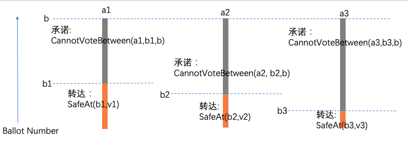
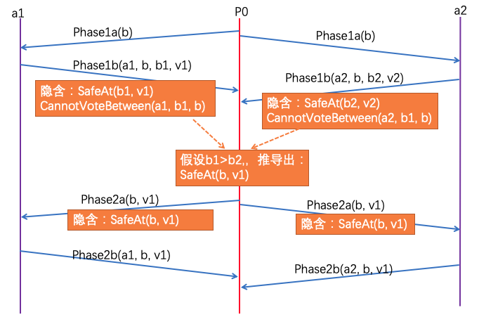

#  觉得Paxos是对的但不知道为什么？探讨下Paxos背后的数学

---

**前言**

Paxos是著名的共识协议，但是同样也以难懂著称。即使是简化版的"Paxos Made Simple"一文[1]，把Paxos的两个阶段描述的比较具体，但是很多人仍然有疑惑。很多读者的感受是：觉得应该是对的，但是不知道为什么是对的。

在理解Paxos的TLA+ Spec [3] (一种形式化验证)的过程中，发现其中隐含了对于Paxos正确性的基于不变式(Invariance)的归纳推理。由于TLA+  spec不易理解，且基本没有高亮显示，所以先抽取一部分必要的、相对易于理解的部分，大部分改用Latex公式表示，并辅以图形和文字，来理解为什么它是正确的。部分内容仍然是 TLA+格式的，但是尽量通过文字或者表格来辅助理解。希望能抛砖引玉。

这些内容是从Paxos的TLA+ Spec根据自己的理解抽取和组织的，并非新东西，如果有发现不准确的地方，欢迎批评指正。Lamport在2019年的一个系列讲座[2]中，也讲解过这个Spec。

Paoxs已经这么难懂，为什么还要用偏形式化的方法去说起推理？个人的观点是：这个东西本身是严格的，不形式化难以确信是对的；其实形式化往往是更准确的，在有些情况下可能还是极简的，不一定是复杂的，并且更容易理解根本。比如：$SafeAt(b,v)$ 表示：”不可能用小于b的任何Ballot Number，选定value v以外的任何值“。虽然文字描述在意义上也没用问题，但是太繁琐，而且在做推理或者证明时变得难以描述。

理解本文的关键在于：理解投票安全性的含义，即上面的$SafaAt(b,v)$。注意，这个保证实际上是向更小的Ballot Number看的，**保证更小的Ballot Number需要满足某个条件**，**而不需要保证更大的Ballot Number怎么样**。这个保证是Paxos协议运行过程中重要的不变式，其正确性也基于这个不变式。

# 1. "对的" 是啥含义？

我们总觉得Paxos是”对的“，但是不知道为什么它是对的。那么啥叫”对的“？我们先看下Consensus的本身的定义：

- Consensus的定义：chosen的元素个数小于等于1。chosen是个集合，下面会提到。
  $$
  \begin{split}
  Consensus =  Cardinality(chosen) \leq 1
  \end{split}
  $$

这里我们借用下式子描述定义，但是不会涉及chosen的赋值，实际在Spec中也没用显式赋值，而是根据Phase2b消息动态计算出来的。

所谓**”对的“**，就是满足Consensus自身的定义，即不会选定$\ge2$个值。展开一下：

- 没选定任何Value是对的；
- 选定了一个Value是对的；
- 多次选定同一个Value也是对的；
- 选定了两个或者多个不同的Value，是错误的。

注意这里描述的是基本paxos，相当于multi paxos里面的单个Instance。多个Instance当然可以选定多个值。在本文最后会简单说下multi paxos。

# 2. Paxos的两阶段回顾

这一部分回顾下"Paxos Made Simple"一文的描述的Paxos的两个阶段。但是从具体形式上，使用了公式化描述。这些公式来自[3]。

## 2.1 常量和变量定义部分

我们先抽取一些必要的变量和常量定义 ，Set和Map跟编程语言中场景概念相同。这些对于有计算机或者数学基础的读者应该不难 。其中常量是需要预先给定值的。

| 名称     | 类型 | 含义                                                         |
| -------- | ---- | ------------------------------------------------------------ |
| Acceptor | Set  | 所有Acceptor的集合                                           |
| Quorum   | Set  | 里面的每个成员，例如Q1，也是一个Set。且Q1是Acceptor的SubSet  |
| maxBal   | Map  | maxBal[a]表示acceptor a响应/Accept过的最大Ballot Number，在phase1b/phase2b修改。**只增不减**。 |
| maxVBal  | Map  | Max Voted Ballot。maxVBal[a]表示acceptor a曾经Vote过的最大的Ballot Number，在phase2b修改。**只增不减**。 |
| maxVal   | Map  | Max Voted Value。 maxVal[a]表示acceptor a曾经Vote过的最大的Ballot Number对应的Value，在phase2b修改。<"2b", a, maxVBal[a], maxVal[a]>构成了一个Phase2b消息四元组。 |
| Votes    | Map  | votes[a] 记录acceptor a曾经vote过的<Bal, Value>元组          |
| msgs     | Set  | 所有发过的消息集合(在Paxos的TLA+ Spec中，msg不删除)          |
| Chosen   | Set  | 被选定的Value的集合                                          |


```tla
CONSTANT Acceptor, 
         Quorum     \* The set of "quorums", where a quorum" is a 
                    \*   "large enough" set of acceptors
CONSTANT Ballot

VARIABLE
        votes,   \* votes[a] is the set of votes cast by acceptor a
        maxBal   \* maxBal[a] is a ballot number.  Acceptor a will cast
                  \*   further votes only in ballots numbered \geq maxBal[a]      
        maxVBal, \* <<maxVBal[a], maxVal[a]>> is the vote with the largest
        maxVal,    \* ballot number cast by a; it equals <<-1, None>> if
                    \* a has not cast any vote.
        msgs     \* The set of all messages that have been sent.
                  VARIABLE chosen       
        chosen    \*The set of all values that can be chosen.
```


对Quorum的要求：

$$
\begin{split}ASSUME\space\space QuorumAssumption =\\ & \land \forall Q \in Quorum : Q \subseteq Acceptor\\                           &\land  \forall Q1, Q2 \in Quorum : Q1 \cap Q2 \neq \{\}  \\THEOREM \space\space QuorumNonEmpty = \\ &\forall Q \in Quorum : Q \neq \{\} \\\end{split}
$$

感兴趣的读者可以自己计算下，要满足上面的式子，Q1, Q2的成员个数不一定都需要达到Acceptor的半数以上，它们的成员个数也不一定是相等的。虽然在实际应用中都简化为多数派。

约定：在后面的很多式子中，我们经常用到逻辑与$\land$和逻辑或$\lor$，它们与我们在关系代数中学到的含义一样。对于 $a \land b$，如果$a$的为false，则不会去尝试计算后面的$b$，这一点对于状态变更很重要，因为只有条件成立才执行某个动作，而整体用一个逻辑表达式来表示。

## 2.2 Phase1a

Phase1a即Proposer给各个Acceptor发送phase1a消息，参数b为Ballot Number。

**发送Phase1a无需任何前提条件**，直接发送1a消息，它不带有任何承诺。注意1a消息，是一个二元组，可以理解成一个结构体。

”UNCHANGED“是TLA+ spec的语法，说名某些变量不变，保留这些只是为了保持式子的完整性，读者可以忽略这些“UNCHANGED” 部分。
$$
\begin{split}
Phase1a(b) = &\land Send([type |-> "1a", bal |-> b])\\
              &\land UNCHANGED <<maxBal, maxVBal, maxVal>>\\
\end{split}
$$
Send的含义：
$$
\begin{split}
Send(m) = msgs' = msgs \cup \{m\}
\end{split}
$$
在Paxos的TLA+ spec里面，没有模拟许多通信信道，而是把所有msg放到一个集合(msgs)里面，通过type和bal来区分。Send(m)就是修改msgs，使得msgs的新状态为：msgs和{m}的并集。$msg'$表示msg被修改后的状态。

$msgs'$的含义：在状态机中，变量$msg$的下一个状态的值。其他变量也类似。另外，这些式子都是个逻辑表达式，即值为true/false。

## 2.3 Phase1b

Phase1b过程，是Acceptor 根据自己的变量去判断，能否响应一个 Phase1a消息，如果符合条件，则响应一个Phase1b。参数 a是Acceptor自己的标识。
$$
\begin{split}Phase1b(a) = & \land \exists m \in msgs : \\                  & \qquad \land m.type = "1a"  \land \space m.bal > maxBal[a]\\                  & \qquad \land maxBal' = [maxBal\space EXCEPT \space ![a] = m.bal]\\                  & \qquad \land Send([type |-> "1b", acc |-> a, bal |-> m.bal, \\                  & \qquad\qquad mbal |-> maxVBal[a], mval |-> maxVal[a]])\\              &\land UNCHANGED <<maxVBal, maxVal>>\end{split}
$$


其中最重要的前提条件是：存在一个 "1a" msg m，m.bal 大于maxBal[a]。即：

​           $ m.type = "1a" \land \space m.bal > maxBal[a]$。

注意，在前提成立的情况下，Phase1b做了两件事(其他所有变量都是Unchanged)：

1) 修改maxBal[a]：$maxBal[a]' = m.bal$;

2) 构建 "1b"消息四元组:$ <"1b", a, m.bal, maxVBal[a], maxVal[a]>$。注意如果a从未执行过phase2b，maxVBal[a]就是-1，此时maxBal[a]为空 。

3) Send  “1b"消息，Send的含义在前面有解释。**注意：** Phase1b等各种操作都被认为是原子的，一旦发送了"1b"，$maxBal[a]$ 必然也增加了，所以下次收到Bal相同的Phase1a，$m.bal > maxBal[a]$ 这个前提条件就不成立了，这是OneValuePerBallot的基础。

后面会看到多个类似下面的式子（phase1b也属于这种），只有前提条件成立时，才执行修改。
$$
\begin{split}
StateChange = &\land 前提条件 \\
        &\land 一个或者多个变量的修改\\
        &\land 不变的部分\\
\end{split}
$$


## 2.4 Phase2a

**前提条件：**

​      1) 没有发送过Bal为b的2a消息(避免重复，因为Spec里面消息不丢弃)；

​       2) 存在一个Quorum Q，里面的每个Acceptor都回复过Phase1b。

**确定Value v，构建Phase2a消息:**

​      1) 定义临时变量Q1b为Q里面所有Acceptor发送的Phase1b消息集合；

​      2) 定义临时变量Q1bv为Q1b中，所有$m.mbal \geq 0$的消息集合；

​      3) 如果Q1bv为空，说明Q里面所有成员都没有Vote过，所以v由Proposer自己决定Value；

​     4) 如果Q1bv不为空，那么v必须是Q1bv中对应mbal最大的那个(即Q里面成员Vote过的最大的Ballot Number对应的value)。
$$
\begin{split}
Ph&ase2a(b, v) =\\ 
  & \land \lnot \exists m \in msgs : m.type = "2a" \land m.bal = b\\
  &  \land \exists Q \in Quorum :\\
  & \qquad       LET \space Q1b = \{m \in msgs :   \land m.type = "1b"\\
  &  \qquad \qquad  \qquad  \qquad  \qquad \qquad \quad \land m.acc \in Q\\
  &  \qquad \qquad  \qquad  \qquad  \qquad \qquad \quad \land m.bal = b \}\\
  &  \qquad \qquad     Q1bv = \{m \in Q1b : m.mbal \geq 0\}\\
  & \qquad      IN  \land \forall a \in Q : \exists m \in Q1b : m.acc = a \\
  & \qquad  \quad \space   \land \lor Q1bv = \{\}\\
  & \qquad \qquad  \space   \lor \exists m \in Q1bv : \\
  & \qquad \qquad  \qquad \qquad    \land m.mval = v\\
  & \qquad \qquad  \qquad \qquad    \land \forall mm \in Q1bv : m.mbal \geq mm.mbal \\
  &\land Send([type |-> "2a", bal |-> b, val |-> v])\\
  &\land UNCHANGED <<maxBal, maxVBal, maxVal>>\\
  \end{split}
$$


## 2.5 Phase2b

​     一个Acceptor执行Phase2b的过程，分为以下几个部分。

### 检查前提条件

​    存在一个"2a"消息m，满足 $m.bal \geq maxBal[a]$。 

### 修改本Acceptor的变量

​       $ maxBal[a]'=m.bal$

​       $maxVBal[a]' = m.bal $

​       $maxVal[a]'= m.val$

### 发送"2b"消息(即Vote)

   "2b"消息带有Acceptor的ID(参数a)，包含从"2a"消息m里面获取的$m.bal$和$m.val$ 。具体为四元组$<"2b", a, m.bal, m.val>$。
$$
\begin{split}
Phase2b(a) = \exists m \in msgs : &\land m.type = "2a"\\
               &\land m.bal \geq maxBal[a]\\
               &\land maxBal' = [maxBal \space EXCEPT \space ![a] = m.bal] \\
               &\land maxVBal' = [maxVBal \space EXCEPT \space ![a] = m.bal] \\
               &\land maxVal' = [maxVal \space EXCEPT \space ![a] = m.val]\\
               & \land Send([type |-> "2b", acc |-> a,\\
               &  \qquad \qquad   bal |-> m.bal, val |-> m.val]) 
\end{split}
$$

**FAQ:  为什么Phase1b和Phase2b都修改 $maxBal[a]'$** ？ 

- 因为执行Phase2b的Acceptor，不一定执行了Phase1b 。

# 3. 相关的式子

下面这些定义不是Paxos两阶段的一部分，但是对于理解两阶段为什么是对的，却是很重要的。

## 3.2 基本函数定义

- VotedFor(a, b, v):  Acceptor a曾经Vote了选票($b$, $v$)，即发送过对应的Phase2b消息。注意Voted/Accepted会交换使用。

- ChosenAt(b, v): 存在一个Quorum Q，Q里面每个Acceptor都曾经投票给($b$, $v$)。我们常说的形成决议/形成多数派/选定一个值/Commit，都是ChosenAt的含义；

- DidNotVoteAt(a, b):  Acceptor a从未给 $Bal = b$ 的选票投票；

- CannotVoteAt(a, b)： Acceptor a不能给任何 $Bal = b$的选票投票而且以前也没有投过。即$maxBal[a] >b$并且DidNotVoteAt(a, b)。 
  $$
  \begin{split}
  VotedFor(a, b, v) =\space &<<b, v>> \in votes[a]\\
  ChosenAt(b, v) = \space  &\exists Q \in Quorum :   \\
                     &  \forall a \in Q : VotedFor(a, b, v) \\
  chosen = &\{v \in Value : \exists b \in Ballot : ChosenAt(b, v)\}\\
    
  DidNotVoteAt(a, b) = &\forall v \in Value : \lnot VotedFor(a, b, v) \\
  CannotVoteAt(a, b) = &\land maxBal[a] > b\\
              &\land DidNotVoteAt(a, b)\\
  \end{split}
  $$
  


#### FAQ: 为什么需要CannotVoteAt里面要包含 DidNotVoteAt?

- 如果没有DidNotVoteAt，假设有个v和 Q1，满足： 
  $$
  \begin{split}
  \exists  v \in Values, Q_1 \in &Quorum: \\ 
  &\forall a \in Q_1: VotedFor(a, b, v) \land maxBal[a]>b
  \end{split}
  $$
  即Q1里面的成员虽然现在不能再VoteFor(b, v)，但是之前已经都Vote过了，那么可能$ChosenAt(b,v)$早已经为true。

### 3.2.1  NoneOtherChoosableAt(b, v)

$$
\begin{split}
NoneOtherChoosableAt(b, v) = \\
\exists Q \in Quorum : \\
     & &\forall a \in Q : VotedFor(a, b, v) \lor CannotVoteAt(a, b)
     \end{split}
$$

- 意义: 除了v以外，不可能用 Bal b选定其他Value。
- **注意**：这个公式，只说别的value没法用b选定，**没有隐含$ChosenAt(b,v)$**一定为true或者false。即它只是否定部分别人，并没有确定自己。
- 实际判断方法: 存在一个Quorum Q，其中任意一个Acceptor a，要么已经投票给了<b, v>，即$VotedFor(a, b,v) = true$，要么没有为Bal b投票且承诺永远不会为Bal = b的选票投票。
- 反证：假设存在某个Value $w$, $w\ne v$, 有ChosenAt(b, w)。则必须有某个 Quorum R，满足： $\forall a \in R, VotedFor(a, b, w)$，根据Quorum的含义，R必然与 Q有交集，假设这个交集包含 Acceptor $a_1$，那么有: $a_1: a_1 \in Q VotedFor(a_1, b, w)$，这与前提矛盾。

**FAQ**: 为什么$NoneOtherChoosableAt(b,v)$不是$NoneOtherChoosableAt(a, b, v)$?

因为NoneOtherChoosableAt是个全局概念，不是某个Acceptor的承诺，而是纵观所有Acceptor，确定$(b, v)$之前一定没有被选定，将来也不会被选定 。

### 3.2.2 SafeAt(b, v)

- 含义： 不可能用小于b的Ballot Number，选定v以外的任何值。这个本质上就是把NoneOtherChoosableAt的Bal范围定义到到一个区间$[0, b-1]$.

- 注意：不能被选定，**不代表不能Accept/Vote**， 只要Vote不形成Quorum即可。

- 公式：
$$
\begin{split}
  SafeAt(b, v) &= \\ 
  &\forall c \in [0,(b-1)] : NoneOtherChoosableAt(c, v)
  \end{split}
$$

### 3.2.3 ShowsSafeAt(Q, b, v)

$$
\begin{split}
ShowsSafeAt(Q, b, v) = \\
  &\land \forall a \in Q : maxBal[a] \geq b \\
  &\land \exists c \in -1..(b-1) : \\
  &\land (c \neq -1) => \exists a \in Q : VotedFor(a, c, v) \\
  &\land \forall d \in (c+1)..(b-1), a \in Q : DidNotVoteAt(a, d)
\end{split}
$$

- 含义：存在一个Quorum Q，同时满足下面的Cond 1和Cond2：
- **Cond 1:** Q内任意一个Acceptor a，满足$maxBal[a] >= b$
- **Cond2:** 存在一个小于b的Ballot c，同时满足下面两个条件：
  - **Cond 2.1:** 如果 $c \ne -1$，则满足：Q中至少有一个Acceptor a, a给(b, v)投过票。注意，如果 $c = -1$，则没有限制，这是一个特殊场景，即所有Acceptor都没有投过票。
  - **Cond 2.2:** Q中没有任何Acceptor a，给[c+1, b-1]之间的任何Bal投过票。即Q里面的所有 Acceptor在[c+1, b-1]这个区间，都完全没有投票。

其中：

- Cond 1和Cond 2.2 保证了[c+1, b-1]这个区间不可能选定任何Value(简单理解：一大半人都承诺不选了)。
- Cond 2.1的定义，如果c不等于-1，则有VotedFor(a,c,v)，那么这个Vote发生时已经保证了SafeAt(c,v)；
  而VotedFor(a,c,v)和OneValuePerBallot，保证了NoneOtherChoosableAt(c, v)；

$$
\begin{split}
定理 \space ShowsSafety & = VotesSafe \land OneValuePerBallot => \\
       & \qquad \qquad \forall Q \in Quorum, b \in Ballot, v \in Value :\\
       & \qquad \qquad \qquad    ShowsSafeAt(Q, b, v) => SafeAt(b, v)
            \end{split}
$$

### 3.2.4 几个不变式

- 先列几个式子，后面会进一步讨论
- VotesSafe: 投票就隐含了是安全的
- OneVote：同一个Acceptor给同一个Bal b投票两次，那么必然是相同的Value
- OneValuePerBallot: 同一个Ballot，对应的(Phase2a)Value必定相同

$$
\begin{split}
VotesSafe = &\forall a \in Acceptor, b \in Ballot, v \in Value : \\
              &VotedFor(a, b, v) => SafeAt(b, v)\\
 OneVote = &\forall a \in Acceptor, b \in Ballot, v, w \in Value : \\
              &VotedFor(a, b, v) \land VotedFor(a, b, w) => (v = w)\\
OneValuePerBallot =  
    &\forall a1, a2 \in Acceptor, b \in Ballot, v1, v2 \in Value : \\
       & VotedFor(a1, b, v1) \land VotedFor(a2, b, v2) => (v1 = v2)
\end{split}
$$

# 4. 消息的含义和一些推导

## 4.1 各个消息的隐含的承诺(不变式)

### Phase1a消息 <"1a", b>:

- 它本身无任何保证，随便发送。

### Phase1b消息$<"1b", a, b, maxVBal[a], maxBal[a]>$：

- 记录了$maxBal[a]'=b$，**承诺**a不会再响应 $Bal <= m.bal$的Phase1a，**承诺**a不会Accept任何 $Bal <m.bal$的Phase2a;
- 如果$maxVBal[a] \neq -1 $  ，表明 $VotedFor(a, maxBal[a], maxVBal[a])$  ，它**如实转达**了$SafeAt(maxBal[a], maxVBal[a])$；我们认为，如实转达也是一种承诺，参见phase2b描述；
- 如果$maxVBal[a] = -1 $  ，表明a没有Accept过任何请求Phase1a，这仅仅是个特例；

为了便于描述，我们定义另外一个式子：
$$
\begin{split} CannotVoteBetween(a, start, end) &= \\   &\forall x \in [start+1, end-1]: CanntVoteAt(a, x) \end{split}
$$
**因此，Phase1b实际上隐含了**：

​                 $CannotVoteBetween(a, maxVBal[a], b) \land SafeAt(maxBal[a], maxVBal[a])$  

其中前一部分是a的承诺，后面的SafeAt是转达。

### Phase2a消息 $phase2a(b, v)$ :

- $ShowSasfAt(Q, b, v)$

  ShowsSafeAt(Q, b, v)是Proposer在收到了某个Quorum Q的所有成员的Phase1b后，推导出Value v，并且$phase2a(b, v)$是安全的。

  下面是一个例子，假设某个quorum Q包含了$a_1, a_2, a_3$这三个 Acceptor，它们回复的Phase1b四元组分别为$<b, a_1, b_1, v_1>, <b, a_2, b_2, v_2>, <b, a_3, b_3, v_3>$。那么$Phase1b(a_1)$ 隐含了 : 
  $$
  \begin{split}
  maxBal[a] \geq b \land CannotVoteBetween(a1, b1, b) \land SafeAt(b1, v1)
  \end{split}
  $$
  

  

  

  其他几个也类似。假设$ b_1>=b_2>=b_3$且b1>-1，那么我们得出：                          
  $$
  \begin{split}
  &\land SafeAt(b1, v1) \\
  &\land \forall a \in Q: \\
  & &\land maxBal[a] \geq b \\
  & &\land CannotVoteBetwwn(a, b1, b)
  \end{split}
  $$
  如果取$c = b_1$，那么可以得出   $ShowsSafeAt(Q, b, v)$，具体推导间下一节。

  考虑特殊情况，$b_1=b_2=b_3=-1$，那么取$c=-1$，由于$[0,b-1]$区间不可能选定任何Value，所以无论给定的v是什么，都能满足  $ShowsSafeAt(Q, b, v)$。

- $OneValuePerBallot$

  不同的Proposer，不会用相同的Ballot Number；如果同一个Proposer用相同的Bal执行两次phase1，不会两次都能收到Quorum的响应(因为执行Phase1b(a)后，maxBal[a]被增加了)。

  

### Phase2b消息$phase2b(a, b, v)$：

- 记录了$maxBal[a]'=b$，具体承诺内容参见Phase1b的相应描述。如果这个acceptor正好也发送过对应的phase1b，那么已经承诺过。
- 记录了$maxVBal[a]'=b, maxVal[a]=v'$，按照前面的讨论，这个式子隐含了$SafeAt(b, v)$。这个记录也表示a**承诺会如实转达**$SafeAt(b,v)$给后续的Bal 更大的Phase1请求。


## 4.3 Proposer如何推导出正确的Value？

前面的$ShowSasfAt(Q, b, v)$是如何得出来的？

我们总结下上面的步骤可以发现: Phase1a不会影响正确性没有承诺，Phase1b是Acceptor根据自己的局部信息在做决策和承诺；Phase2a是最复杂的，它根据各个Acceptor的反馈在做决策，而这些Acceptor的状态是变化的(起码maxBal可能变化)；Phase2b 实际上也是各个Acceptor根据局部信息和收到的消息在做决策。

注意，Proposer在 **Phase2a推导的v，已经决定了SafeAt(b, v)的成立，它的成立跟是否收到Phase2b无关**，如果一个 Acceptor a拒绝了 Phase2a，那么是因为$maxBal[a]>b$，而SafeAt(b, v)考察的是 $ < b$的那部分Bal。

### 4.3.1 把Ballot Number划分三个区间

继续按照上面的例子来思考，我们可以把 $<=b$ 的Bal分为三个区间：

$[0, b_1-1], [b_1, b_1], [b_1+1, b-1]$

假设一个Acceptor收到了一个Phase2a，它如何确认自己可以安全地Vote呢？能否保证$SafeAt(b, v)$?  回顾下$SafeAt$的式子，它需要保证整个区间都满足 NoOtherChoosable。
$$
\begin{split}
SafeAt(b, v) &= \\ 
&\forall c \in [0,(b-1)] : NoneOtherChoosableAt(c, v)
\end{split}
$$
### 4.3.2 分区间推导

以下分别得出三个区间的NoneOtherChoosableAt。

#### (A). 区间$[0, b_1-1]$

在发送Phase2a前，已经收到了$a_1$的四元组$<b, a_1, b_1, v_1>$，即$VoteFor(a_1, b_1, v_1)$为true，这个本身隐含了$SafeAt(b_1, v_1)$为true。

#### (B). 区间$[b_1, b_1]$

这个单值区间只有$b_1$，基于下面的式子推理： 
$$
\begin{split}
OneValuePerBallot \land VotedFor(a_1, b_1, v_1) &=>\\
    &  NoneOtherChoosableAt(b_1, v_1)
\end{split}
$$

#### (C). 区间$[b_1+1, b-1]$

$ShowsSafeAt(Q, b, v)$已经说明
$$
\begin{split}
\exist Q \in Quorum &: \\
   &\qquad \forall a \in Q: CannotVoteBetween(a, b_1, b)
   \end{split}
$$
而$b_1$是最大值，那么在区间$[b_1+1, b-1]$上上图中灰色区间的最短部分(公共部分)，就不可能选定任何Value，因为任意两个Quorum都是相交的。


## 4.4 算法正确性的简单证明

### 4.4.1 几个不变式

- $Phase2a(b, v)$已经隐含了$SafeAt(b, v)$成立；
- 任何一个$ChosenAt(b,v)$必然有一个对应的 $Phase2a(b, v)$。

### 4.4.2 反证

假设上述的 Paxos算法不正确，会选定两个或者多个不同的Value，即$ChosenAt(b_1, v_1)$和$ChosenAt(b_2, v_2)$都为 true。根据上面描述的不变式，有：$Phase2a(b_1, v_1) \land Phase2a(b_1, v_1)$都为 true。

我们假设$b_1>b_2$。那么$Phase2a(b_1, v_1) =>SafeAt(b_1, v_1)$，根据定义：
$$
\begin{split}
SafeAt(b_1, v_1) &= \\ 
&\forall c \in [0,(b_1-1)] : NoneOtherChoosableAt(c, v_1)
\end{split}
$$
由于$b_2 \in [0, b_1-1]$，所以有$NoneOtherChoosableAt(b_2, v_1)$成立，这与$ChosenAt(b_2,v_2)$矛盾。

$b_1=b_2$是另外一个问题，前面描述的OneVotePerBallot已经保证了它不会出现。

## 4.5 一张图回顾下整体过程

下面一张图较完整低说明了两阶段的过程，主要强调各个消息的含义。为了方便，只画出了两个acceptor $a_1, a_2$。注意橙色底色的是消息隐含的承诺/转达。为了简化，图中没有体现一些变量的变化(例如$maxBal$。这里假设 $\{a1, a2\}$是一个Quorum，且$b1>b2$，P0在收到两个 phase1b后，就可以推导出$SafeAt(b, v_1)$。

  

# 5 一些FAQ

## 5.1 分析下典型的并发场景？

简单来说，如果一个proposal未能进入Phase2(比如Phase1b未构成Quorum)，不够成任何value的选定，不可能影响chosen的值。所以我们跳过这种问题。只有进入Phase2a的过程，才有可能导致value被选定。

假设Proposer p1顺利完成了Phase1，收到了某个quorum Q1内所有成员的Phase1b消息，然后发送$phase2a(b,v)$。但是在p1收齐某个Quorum Q2的phase2b之前，另外一个proposer p2开始了phase1。我们假设p2使用的Ballot Number  $b'$。分两种情况：

### 假设:  $b'<b$

这个场景下，p2的消息，都会被Q1内所有acceptor拒绝，所以p2不可能进入Phase2a阶段。由于$b' < b$，对 p1的phase2也没有任何影响。

### 假设:  $b'>b$

- **场景一:** 假设存在至少一个Quorum Q2，Q2里面所有的acceptor在给p1发送了phase2b后，才处理p2的phase1。这就表示$ChosenAt(b, v)$ 成立。剩下的问题时：p2如何保证不会选定v以外的Value。由于 Q2是多数派，p2收到的phase1b消息中，至少有一个包含了<b, v>，也就是保证了SafeAt(b, v)。
- **场景二:** 场景一以外的其他情况，即：对于任何一个Quorum Q, Q里至少有一个acceptor，先处理了p2的phase1a，然后才处理p1的phase2a。先处理p2的$phase1a(b')$的acceptor a, maxBal[a] 变成了 $b'$，所以不会Accept phase2a(b, v)，导致<b, v>无法被选定，因为根本不够成Quorum。既然$(b,v)$不可能被选定，不影响chosen的值。 p2的执行过程，跟p1是一样的。

 把上面例子中的p2换成p2, p3等多个，且对应的Bal都大于b，那么分析过程也是结论是类似的。

## 5.2 有一个未形成共识的$Phase2a(b_1, v_1)$，如果将来形成共识，value会是$v_1$么？

不一定，假设只有$a_1$ vote了这个phase2a，然后$a_1$ 宕机了，其他节点形成了共识，就仿佛这个phase2a没发生过。

## 5.3 如果有多个未形成共识的Phase2?

假设一共有5个acceptor ${a1, a2, a3, a4, a5}$，$VotedFor(a_1,b_1,v_1)$, $ VotedFor(a_2,b_2, v_2)$ 和 $VotedFor(a_3,b_3, v_3)$都成立，且$b_1 \neq b_2 \neq b_3$,  $v_1\neq v_2  \neq v_3$，$a_4, a_5$都没有Vote过，如果将来形成共识，value会是哪个？

1） 假设有个更大的Bal $b_x$, 它的Phase1只有$a_1, a_4, a_5$参加了，并形成共识，那么选定的就是$v_1$。

2） 如果$a_1, a_2$都参加了$b_x$的Phase1，那么就根据$b_1, b_2$的最大值来决定，选取相应的Value。参见前面的推导过程。

**思考题**：会不会出现4个Acceptor，分别Vote了不同的Value(可以是不同的Ballot)? 为什么？

## 5.4 Instance是什么？

- 假设某西方国家议会每天只形成一个决议（或者说通过一个提案），但是每个州都有自己的提案，都希望自己的提案早日被通过。那么，每一天形成的一个决议的过程，就是一个Instance。一年有365个Instance。Instance之间顺序是有意义的，1号决议不能在 2号决议后执行，2号决议可能还废除了1号决议。
- Ballot Number跟Instance之间的关系：每个州都在做提案，到底通过谁呢，但是一天只能通过一个提案，到底通过哪一个？可以想象成各个州在竞标，把Ballot Number想象成不断增加的竞标出价。

## 5.5 Multi Paxos的Multi是什么？

### 要解决的问题

- 如果每个Instance都完整地走两个Phase，即使完全没有并发proposal导致冲突，也需要两轮网络交互
- 并发propose导致冲突多： 考虑多个 Proposer都不断增加自己的Ballot Number，让其他Proposer的phase2不能顺利完成。会导致单个Instance的决议形成比较慢。

### 基本做法

- Multi Paxos是用来提升效率的，无关正确性。
- 简单来说，让一个Phase1 对应多个Phase 2。即：一个proposer用Ballot Number b1完成Phase1后，认为自己是leader，用b1去发送多个Instance的phase2。客户都会把提案交给 Leader去提议，除非认为Leader宕机了。
- 对于每个Instance来说，那个Proposer先提proposal，用什么Ballot Number，都不影响正确性。所以，leader宕机或者别人认为它已经不是Leader，都不影响正确性。


[1] Leslie Lamport的Paper: Paxos Made Simple

[2] Leslie Lamport的讲座视频：The Paxos algorithm or how to win a Turing Award. 

[3] Paxos的TLA+ Spec: https://github.com/tlaplus/Examples/tree/master/specifications/Paxos


